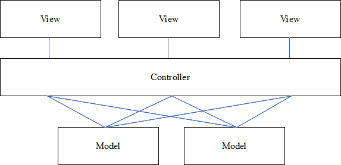
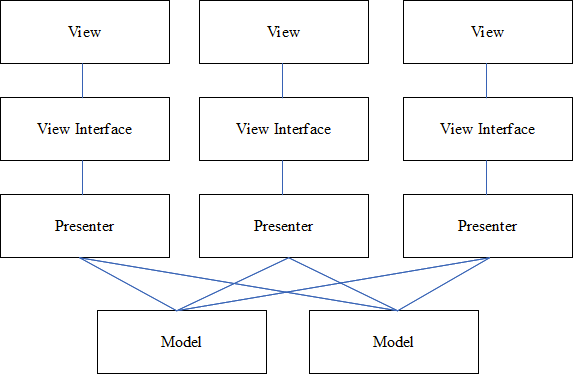

// Chapter 1
Architectures Samples

MVP :
    Inspiration - Separation of Concern : More readable, Testable, Maintainable

    Problem - 1 to be solved : Massive Activity/Fragment code (UI lifecycle + business logic), no SoC, Difficult to test, Difficult to maintain large class,
    Activity Responsibility : Respond to lifecycle events from OS, non lifecycle logic into Activity class violates SoC
    Activity Tests run on emulator which is time taking for unit tests

    Solution - 1 : MVC
        Controller determines which view to display
        All views(Activity/Fragment) share same controller
        View delegates all actions to controller
    Problem - 2 with MVC : SoC in controller(Business Logic + View Logic)

    Solution - 2 : MVP
        Presenters with business logic for individual views, Contract interface between Presenter and View for communication
        View delegates to Presenter, Presenter delegates to model, Model callbacks Presenter, Presenter callbacks View
        Each View(Activity/Fragment) has its own presenter
        Easier to unit test because interaction with the view is through an interface

